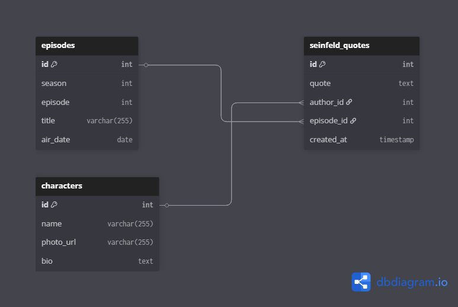

# Custom_API – Seinfeld Quotes API

<p>
  
  
  
  
  
  
  
  
  
  
</p>

A full-stack project that serves Seinfeld quotes via a Flask API and displays them on a frontend using plain HTML/JS. Features include logging, pagination, API documentation, and CSV-to-Postgres integration.

---

## 🗂 Project Structure

Custom_API/
├─ app.py
├─ seinfeld_loader.py
├─ Seinfeld.csv
├─ schema.sql
├─ quotes.sql
├─ FrontEnd/
│ ├─ index.html
│ └─ images/
├─ Design_Documents/
│ ├─ api_documentation.md
│ ├─ database_design.md
│ ├─ proposal.md
│ └─ wireframes/
│ ├─ wireframe1.png
│ └─ wireframe2.png
├─ Tests/
├─ venv/
└─ README.md

---

## 📊 Database Design

ERD for the Seinfeld quotes database:



> Shows the `seinfeld_quotes` table and its columns: `id`, `quote`, `author`, `season`, `episode`.

---

## 🛠 Database Setup

1. Install PostgreSQL (if not already installed).
2. Create the database:

```
createdb seinfeld
```

3. Run the SQL schema script:

```bash
psql -U your_username -d seinfeld -f schema.sql
```

4. Load data from the CSV file:

sql

```
-- In the psql terminal:
\copy seinfeld_quotes(quote, author, season, episode) FROM
'Seinfeld.csv' CSV HEADER;
```

🖥 Backend Setup
Activate the virtual environment:

```bash

source venv/bin/activate   # Linux/Mac
venv\Scripts\activate      # Windows
```

2. Install dependencies:

```
pip install -r requirements.txt
```

3. Run the Flask API server:

```bash
python3 app.py
```

Backend runs at http://localhost:5000.

🌐 Frontend Setup
Navigate to the frontend folder:

```bash
cd FrontEnd
```

2. Start a simple HTTP server:

```bash
python3 -m http.server 8000
```

Open your browser at http://localhost:8000.
The frontend communicates with the backend API using CORS.

🔗 API Endpoints
Get all quotes (paginated):

```
GET /quotes?page=1&per_page=10
```

Response Example:

json
Copy code
{
"page": 1,
"per_page": 3,
"total_quotes": 334,
"total_pages": 112,
"quotes": [
{
"author": "Jerry",
"season": 1,
"episode": 1,
"quote": "You look like you live with your mother!"
}
]
}
Get quotes by author (case-insensitive):

```bash
GET /quotes/<author>
```

Response Example:

json
Copy code
[
{
"author": "Elaine",
"season": 1,
"episode": 4,
"quote": "You made a man cry? I've never made a man cry..."
}
]
🧪 Testing
Run pytest:

```
pytest -v
```

Tests cover:

/quotes endpoint

/quotes/<author> endpoint

JSON response structure and success cases

📝 Features Implemented
Logger (Flask + Python logging)

Pagination on /quotes

API documentation via Sphinx

Unit tests with pytest

Flask-CORS enabled for frontend communication

⚡ Future Improvements
User authentication

Caching responses for faster performance

WebSockets for live quote updates

Queuing system for long-running background tasks

## 📘 Sphinx Documentation

This project includes developer documentation built with [Sphinx](https://www.sphinx-doc.org/).

### 📦 Requirements

Make sure you have Python and `pip` installed. Then install Sphinx:

```bash
python3 -m pip install sphinx
```
